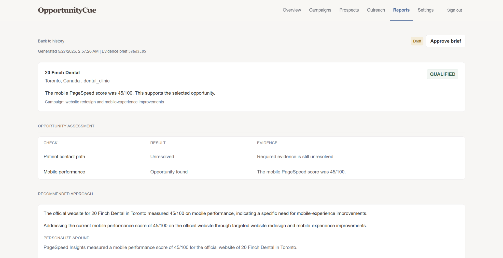
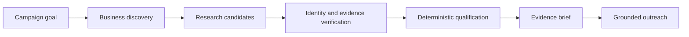
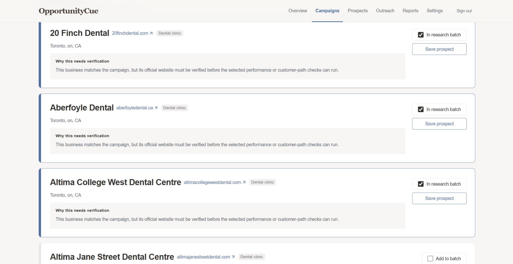
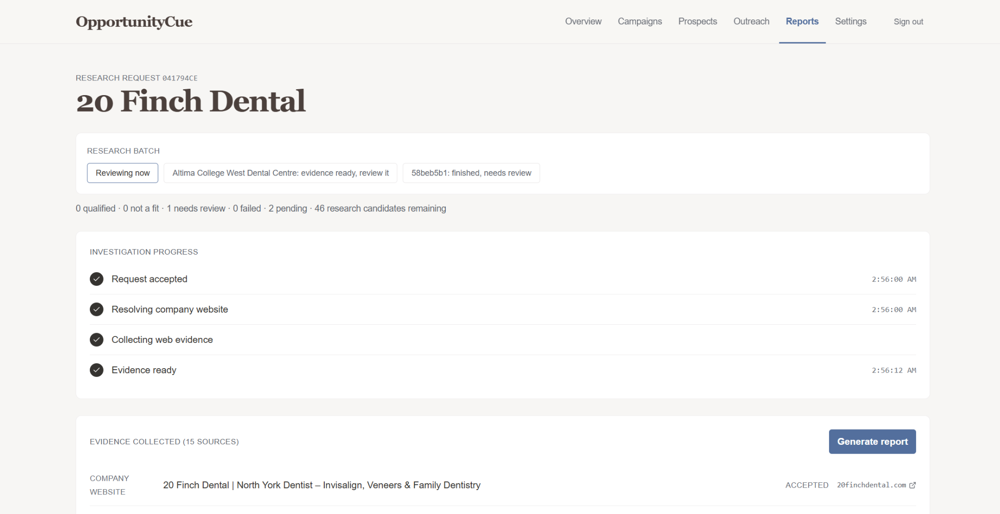

# OpportunityCue

Client prospect research grounded in verifiable public evidence.

OpportunityCue helps freelancers turn a service offering and target market into a research workflow. It discovers businesses, verifies identity and public evidence, evaluates predefined opportunity conditions, and prepares outreach when the evidence supports qualification.

[Live demo](https://opportunitycue.vercel.app)

> The hosted API uses Render's free tier, so the first request after a period of inactivity can take longer while the service starts.

## What it does

A campaign starts with a plain-English goal such as:

> I'm a freelance web developer looking for independent dental practices in Toronto, Canada that I can pitch website redesign and mobile-experience improvements to.

OpportunityCue interprets the goal, checks that the requested market is supported, discovers candidate businesses, and places selected prospects into a research queue.

A discovered business is treated as a candidate for verification. It is not automatically treated as a sales opportunity.

## Example: 20 Finch Dental

For a Toronto campaign focused on dental practices and website improvements, OpportunityCue verified `20finchdental.com` as the official website and measured its mobile PageSpeed score at **45/100**.

That evidence supported the mobile-performance opportunity. The patient contact-path check remained unresolved because the required evidence for that condition was not confirmed.

The final report kept those results separate and used the verified finding to prepare prospect-specific outreach.

## How it works

OpportunityCue uses AI for goal interpretation, specialist research summaries, and outreach drafting. Qualification itself is performed from persisted evidence and predefined rules in application code.

## Product walkthrough

### Discover research candidates

OpportunityCue searches for businesses that match the campaign and explains why each candidate still needs verification before qualification.

### Verify the business and evidence

Research resolves the business identity, checks the official website or social profile, and collects the evidence required by the selected opportunity models.

In the 20 Finch Dental run, the official website was accepted before PageSpeed and website checks were used for qualification.

### Qualify from evidence

The report separates confirmed opportunities from unresolved checks. A missing signal does not become a positive claim, and a discovery assumption does not automatically become qualification evidence.

The 20 Finch Dental result qualified on measured mobile performance while leaving the patient contact-path check unresolved.

## Product rules

- Discovery produces research candidates, not automatic opportunities.
- Qualification comes from persisted evidence and predefined opportunity rules, not from the language model's opinion.
- Outreach is prepared only for qualified prospects and must be grounded in accepted evidence and observed contact paths.

## Current research scope

OpportunityCue currently supports research for:

| Area | Current checks |
| --- | --- |
| Web and conversion | Official web presence, mobile PageSpeed performance, and selected booking, contact, customer, membership, retail, and clinic paths |
| Social presence | Verified official social presence and measured dormancy |
| Business categories | Beauty and wellness, restaurants and cafes, fitness and gyms, boutiques and retail, dental and selected clinics |

The product does not predict whether a business will buy a service or infer revenue loss from a technical signal. A qualification means that the collected evidence satisfied the conditions of the selected opportunity model.

## Tech stack

| Area | Tools |
| --- | --- |
| Frontend | React, TypeScript, Vite, Tailwind CSS, React Router |
| Backend | Python, FastAPI, Pydantic, SQLAlchemy, Alembic, PostgreSQL |
| AI and research | CrewAI, Gemini, Groq, Tavily, Serper, Open Places, Google PageSpeed, Apify |
| Auth and data | Supabase Auth, Supabase PostgreSQL, JWT verification with Supabase JWKS |
| Deployment | Vercel, Render, Docker |

## Deployment

Frontend: [opportunitycue.vercel.app](https://opportunitycue.vercel.app)

Backend health: [ai-client-prospecting-platform.onrender.com/health](https://ai-client-prospecting-platform.onrender.com/health)
